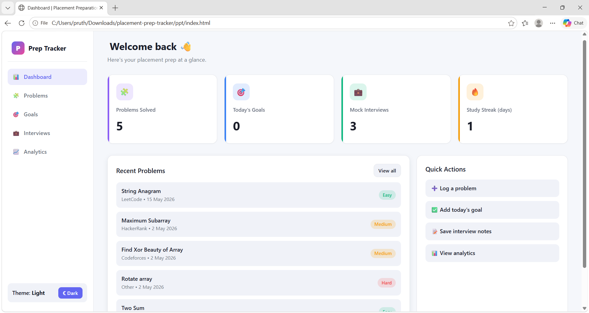
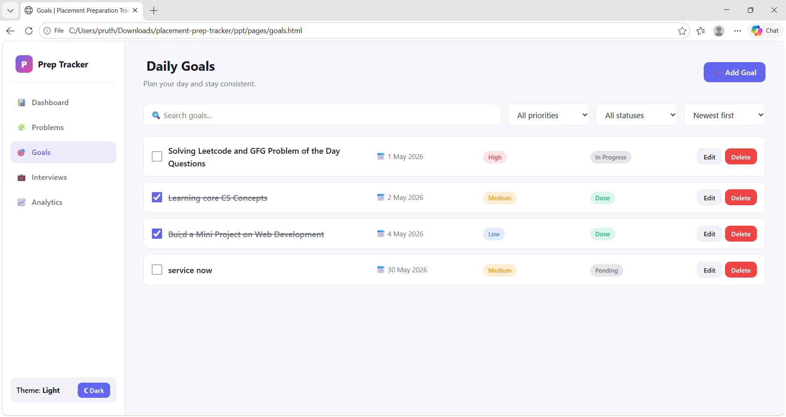
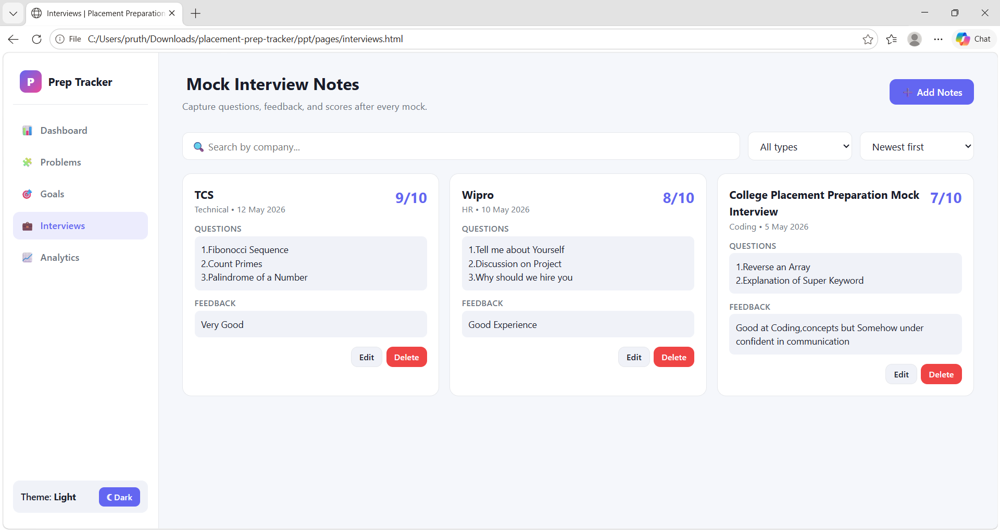
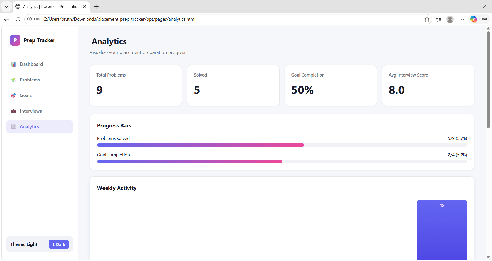

# Placement Preparation Tracker

🔗 **[Live Demo](https://pruthvi-7195.github.io/Placement_Preparation_Tracker/)**

A modern, responsive web application designed to help students organize, track, and monitor their placement preparation. The application provides a centralized platform for tracking coding problems, daily goals, mock interviews, study streaks, and preparation analytics.

## ✨ Features

* 📊 **Dashboard** — View Problems Solved, Today's Goals, Mock Interviews, and Study Streak.
* 💻 **Problem Tracker** — Add, edit, and delete problems with platform, difficulty, and status. Includes search, filtering, and sorting.
* 🎯 **Daily Goals** — Create goals with deadlines and priorities, mark them as completed, and track progress.
* 💼 **Mock Interview Notes** — Record company, interview type, questions, feedback, and scores.
* 📈 **Analytics** — View preparation statistics, progress bars, weekly activity, consistency tracking, and study streaks.
* 🌙 **Dark / Light Mode** — Switch between themes with the preference stored persistently.
* 📱 **Responsive Design** — Works across desktop and mobile screen sizes.
* 🔔 **Toast Notifications** — Provides feedback for user actions.
* ✅ **Form Validation** — Validates user inputs before saving.
* 💾 **Local Storage** — Persists application data using browser `localStorage`.
* 🧭 **Sidebar Navigation** — Provides easy navigation between application modules.

## 🛠️ Technologies Used

* **HTML5** — Semantic structure and application pages
* **CSS3** — Responsive layouts, CSS Grid, Flexbox, variables, and theming
* **JavaScript (ES6+)** — Application logic and dynamic interactions
* **LocalStorage** — Client-side data persistence
* **Git & GitHub** — Version control and source code hosting
* **GitHub Pages** — Deployment and live hosting

## 📁 Project Structure

```text
Placement-Preparation-Tracker/
├── index.html                  # Dashboard
├── pages/
│   ├── problems.html           # Problem tracker
│   ├── goals.html              # Daily goals
│   ├── interviews.html         # Mock interview notes
│   └── analytics.html          # Preparation analytics
├── css/
│   ├── style.css               # Global styles and layout
│   ├── dashboard.css
│   ├── problems.css
│   ├── goals.css
│   ├── interviews.css
│   └── analytics.css
├── js/
│   ├── theme.js                # Theme and shared utilities
│   ├── dashboard.js
│   ├── problems.js
│   ├── goals.js
│   ├── interviews.js
│   └── analytics.js
├── components/
│   └── sidebar.html            # Sidebar markup
├── screenshots/
│   ├── Dashboard.png
│   ├── Goals.png
│   ├── Interviews.png
│   └── Analytics.png
└── README.md
```

## 🚀 Getting Started

### Run Locally

This is a static web application and does not require a backend or build process.

1. Clone the repository:

```bash
git clone https://github.com/pruthvi-7195/Placement_Preparation_Tracker.git
```

2. Navigate to the project directory:

```bash
cd Placement_Preparation_Tracker
```

3. Open `index.html` in a modern web browser.

For the best experience, serve the project using a local development server to avoid browser `file://` restrictions.

### Live Demo

The application is deployed using GitHub Pages:

🔗 **[Open Placement Preparation Tracker](https://pruthvi-7195.github.io/Placement_Preparation_Tracker/)**

## 💾 Data Storage

The application uses browser `localStorage` to store user data. No backend or database is required.

| Key              | Purpose                         |
| ---------------- | ------------------------------- |
| `ppt_problems`   | Stores the problem list         |
| `ppt_goals`      | Stores daily goals              |
| `ppt_interviews` | Stores mock interview notes     |
| `ppt_streak`     | Stores the current study streak |
| `ppt_activity`   | Stores daily activity counts    |
| `ppt_theme`      | Stores the selected theme       |

### Reset Application Data

To reset the application data, run the following command in the browser's DevTools console:

```javascript
[
  'ppt_problems',
  'ppt_goals',
  'ppt_interviews',
  'ppt_streak',
  'ppt_activity'
].forEach(key => localStorage.removeItem(key));
```

## 🎨 Key Implementation Details

* Semantic HTML5 structure
* CSS variables for theme management
* CSS Grid and Flexbox for responsive layouts
* Vanilla JavaScript with ES6+ features
* Modular JavaScript files for different application modules
* Client-side form validation
* Browser `localStorage` for persistent data
* No external frameworks or build tools required

## 📸 Screenshots

### Dashboard



### Goals



### Interviews



### Analytics



## 📌 Project Highlights

* Built a complete placement preparation tracking application from scratch.
* Implemented CRUD operations using Vanilla JavaScript and `localStorage`.
* Developed responsive dashboards, analytics, forms, navigation, and theme switching.
* Deployed the application using GitHub Pages.

## 📝 License

This project is licensed under the **MIT License**.

---

⭐ If you find this project useful, consider giving the repository a star!
